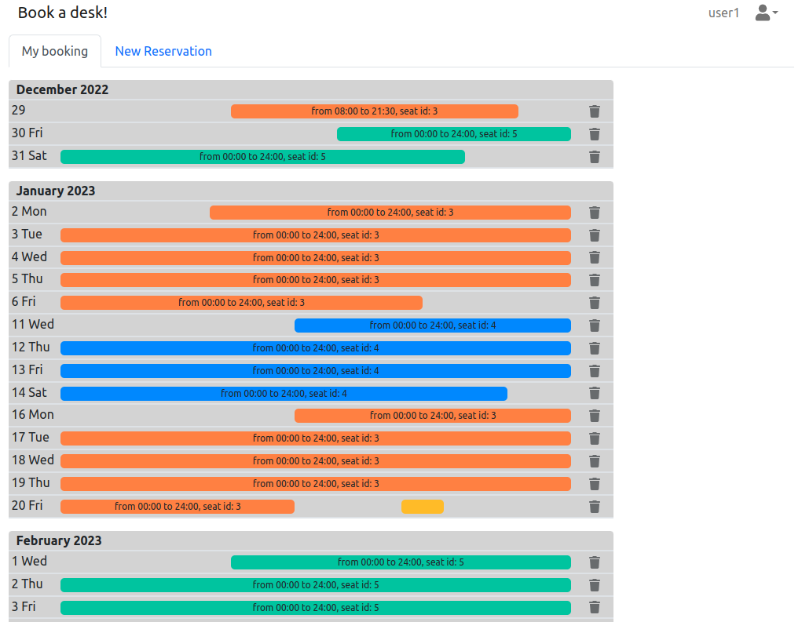
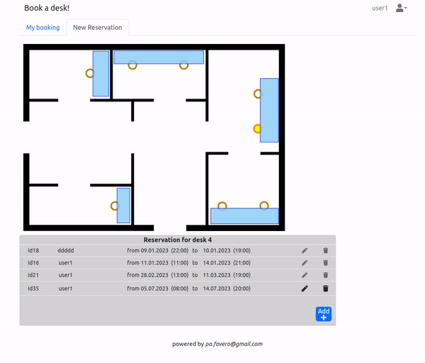

# PROTOTYPE - Book a desk

Open source PROTOTYPE for management of hybrid work. It gives the employees a simple tool to select and schedule themselves a desk from an interactive map directly. 

Have a look at the website:
https://book-a-seat.vercel.app

## Technologies
This Repo contains all codes for the frontend and it is a pure React application (generated with create-react-app https://github.com/facebook/create-react-app ). 

I use nextjs as a framework to retrieve data from the db, because nextjs supports  API routes (it provides a solution to build a public API). For example if the React App needs to know all reservation related to seat 1, it will makes the following API request: http://___YOR_NEXTJS_URL___/api/reservations?selSeat=1

The nextjs project can be found https://github.com/pafavero/nextjs_book_a_seat )
The used dababase contains only 3 tables and the sql to generate them can be found here:
https://github.com/pafavero/nextjs_book_a_seat/blob/main/sql/create_db.sql 

Frontend: Reactjs, Bootstrap

Backend: Nodejs, nextjs API

Database: Postgres

Deployment Frontend -: Vercel and Backend -: Supabase

## Available Scripts

This project was bootstrapped with [Create React App](https://github.com/facebook/create-react-app).

In the project directory, you can run:

### `npm start`

Runs the app in the development mode.\
Open [http://localhost:3000](http://localhost:3000) to view it in your browser.

The page will reload when you make changes.\
You may also see any lint errors in the console.

### `npm run build`

Builds the app for production to the `build` folder.\
It correctly bundles React in production mode and optimizes the build for the best performance.

The build is minified and the filenames include the hashes.\
Your app is ready to be deployed!

See the section about [deployment](https://facebook.github.io/create-react-app/docs/deployment) for more information.

